# AgentFleet

<p align="center">
  
  
  
  
  
</p>

<p align="center">
  <strong>Self-hosted platform for autonomous computer-use agents.</strong><br>
  Spin up isolated Linux desktops, record tasks by demonstration, let AI workers execute and continually self-improve, and get alerted on your phone when human judgment is required.
</p>

---

```
  Flutter Companion App               Admin Console (React 19)
             \                                  /
              \                                /
        ┌──────▼──────────────────────────────▼──────┐
        │             Orchestrator (Go)              │
        │   Fleet Manager · Agent Loop · Vault       │
        │   Refinement Engine · Multi-Model Gateway  │
        └──────┬──────────────────────────────┬──────┘
               │ Docker API                   │ HTTP / Internal Net
        ┌──────▼──────┐                ┌──────▼───────────────┐
        │ Sandbox     │      ...       │ Sandbox              │
        │ XFCE + Xvfb │                │  agentd (AT-SPI/GUI) │
        │ noVNC Proxy │                │  Persistent Py REPL  │
        └─────────────┘                └──────────────────────┘
```

---

## Key Superpowers

* 🛡️ **Hard-Sandboxed Desktops**: Containerized Ubuntu XFCE sessions governed by strict cgroup envelopes (CPU, RAM, disk quotas), optional GPU passthrough, and kernel-level `nftables` network egress policies.
* ⏪ **OS Snapshot Time-Machine & Auto-Rollback**: Instant copy-on-write workspace snapshots before risky file/system actions with automatic rollback if assertions fail.
* 🔌 **Native Model Context Protocol (MCP) Bridge**: Connect Anthropic open-standard MCP tool servers (GitHub, Postgres, Slack, Brave Search, AWS) out of the box with zero custom code.
* ⛓️ **Multi-Bot Workflow DAG Pipelines**: Visual multi-agent workflow DAG builder chaining specialist bots across sequential stages (e.g. Audit ➔ Code ➔ Test ➔ PR).
* 📊 **Token Cost & Financial Telemetry Cockpit**: Live tracking of Prompt, Completion, and Cached tokens, model response latency, and dollar spend ($ USD).
* 📦 **Portable `.agentfleet.yaml` Archetype Hub**: One-click serialization, export, and import of complete bot personas, tools, and environments.
* 🎬 **Interactive Grok-Style Demonstration Recording HUD**: Teach bots by doing! Record live desktop demonstrations that compile directly into semantic `SKILL.md` playbooks.
* 🎙️ **Pocket TTS Real-Time Voice Co-Pilot**: Ultra-low-latency CPU text-to-speech powered by Kyutai Labs' Pocket TTS with 6 curated voice models (4 Male: **Shadow** [default], Atlas, Vortex, Echo; 2 Female: Aura, Lyra) for spoken duplex dialogue.
* 🐝 **Autonomous Multi-Agent Swarms & Mission Control**: Collaborative multi-bot team swarms operating on a shared blackboard with peer review and real-time deliverable handoffs.
* 🔐 **Shared Fleet Vault & Inter-Agent Comms**: Direct peer-to-peer inter-bot messaging, broadcast channels, shared secret variables, and browser cookie/session handoffs.
* 🧠 **Persistent Long-Term Episodic Vector Memory**: Cross-fleet semantic memory index for storing and retrieving successful workflows, API workarounds, and AT-SPI coordinates across all sandboxes.
* ⚡ **Event-Driven Webhook Sinks & 24/7 Autopilot**: Public ingress endpoints (`/api/webhooks/{token}`) for GitHub PRs, Comp AI CRM leads, Stripe events, plus autonomous background cron schedules.
* 👁️ **Hybrid Visual & Accessibility Perception**: Blends high-resolution WebP visual frames with AT-SPI semantic accessibility trees. Automatic image-to-display coordinate mapping ensures pixel-perfect interaction across arbitrary resolutions.
* 🧠 **Continual Harness & AI Self-Refinement**: Post-task refinement engine inspects execution trajectories to self-heal fragile coordinate clicks into robust accessible selectors, automatically evolving `SKILL.md` workflows from `v1` to `v2`.
* 🔀 **Recursive Sub-Agent Orchestration**: Agents can dynamically spawn and coordinate child sub-agents (`spawn_agent`) to handle parallel research, compilation, or verification tasks with full parent-child hierarchy tracking.
* 🐍 **Persistent Python REPL Substrate**: Embeds a stateful, interactive Python REPL inside the sandbox daemon (`agentd`). Agents can manipulate data, query the AT-SPI bus programmatically, and maintain state variables across turns.
* 📱 **Mobile Human-in-the-Loop Triage**: First-class Flutter mobile companion with time-sensitive push dispatch for CAPTCHAs, MFA, and human approvals with 1-tap resolution.
* 🌐 **Universal Model Fallback Chain**: Works out-of-the-box with local vision models (Ollama / `qwen2.5vl:7b`), OpenAI, Anthropic, Google Gemini, or any OpenAI-compatible gateway (vLLM, LiteLLM) configured as a resilient fallback chain.

## Pre-Configured Bot Archetypes

AgentFleet includes 11 out-of-the-box, role-specialized agent personas equipped with domain tools, curated repositories, and structured Domain Operating Playbooks:

| Archetype | Icon | Category | Recommended Hardware | Pre-installed Tooling & Curated Repos |
| :--- | :---: | :--- | :--- | :--- |
| **Fleet Manager & Commander** | 🎯 | Management | `standard` (4 vCPU, 8 GB) | `tmux`, `git`, `gh`, `ripgrep`, `jq`, `curl`, `n8n`, `htop`, `tree` — decomposes goals & delegates to specialists |
| **CyberSec PenTester** | 🛡️ | Security | `standard` (4 vCPU, 8 GB) | `nmap`, `wireshark`, `ffuf`, `metasploit`, `ghidra`, `semgrep`, `sqlmap`, `burpsuite`, `nuclei`, `subfinder`, `SecLists` |
| **Full-Stack Architect** | 💻 | Engineering | `developer-heavy` (8 vCPU, 16 GB) | VS Code, Node/Bun/pnpm, Go, Python, Rust, Docker CLI, PostgreSQL, Redis, Playwright, `gh`, `lazygit`, `ripgrep` |
| **DevOps & Cloud SRE** | ⚙️ | DevOps | `developer-heavy` (8 vCPU, 16 GB) | `kubectl`, `helm`, `terraform`, `ansible`, `k9s`, `docker`, `aws-cli`, `gcloud`, `promql-cli`, `grafana-cli`, `trivy` |
| **QA & UI/UX Auditor** | 🎨 | QA & Design | `standard` (4 vCPU, 8 GB) | Playwright, Cypress, Lighthouse CI, Pa11y, Axe-Core, GIMP, Figma Web, ImageMagick, Screenkey |
| **Game Dev & 3D Engine** | 🎮 | Gaming & 3D | `developer-heavy` (8 vCPU, 32 GB, GPU) | Godot Engine 4, Blender 3D, Aseprite, Pygame, GLTF validator, Shader compiler, RenderDoc, MeshLab |
| **Social Media & Growth** | 📱 | Marketing | `micro` (2 vCPU, 4 GB) | Chromium Multi-Profile, Postiz/Buffer CLI, Photopea, FFmpeg Short-Clipper, `yt-dlp`, Whisper |
| **Media Studio & Video** | 🎬 | Creative | `power-user` (8 vCPU, 24 GB, GPU) | FFmpeg, Kdenlive, Audacity, Whisper AI Transcriber, ImageMagick, ComfyUI, OBS Studio, HandBrake |
| **Agentic CRM (Comp AI)** | 🤝 | Sales & CRM | `standard` (4 vCPU, 8 GB) | Comp AI CRM (`trycompai/crm`), PostgreSQL, Email Drafting Engine, Lead Enrichment API, DuckDB, `n8n` |
| **Data Scientist & Quant** | 📈 | Data & Finance | `developer-heavy` (8 vCPU, 16 GB) | JupyterLab, Polars, DuckDB, Pandas, yfinance, Plotly, SciPy, Quarto, TA-Lib, Scikit-Learn |
| **Deep Academic Researcher**| 🔬 | Research | `standard` (4 vCPU, 8 GB) | Zotero, Pandoc, Typst, LaTeX, PDFMiner, BeautifulSoup4, WeasyPrint, Calibre |

---

## 🐍 Python SDK & `fleetctl` CLI

AgentFleet includes a pip-installable Python client SDK and command-line utility:

```bash
pip install agentfleet
```

### Programmatic Python Usage:
```python
from agentfleet import FleetClient

# Connect to orchestrator
fleet = FleetClient("http://localhost:8080", token="your-api-token")

# Deploy bot archetype and run goal
bot = fleet.deploy_bot("cyber_ops", name="security-auditor")
task = bot.run("Run SAST vulnerability scan and compile CVSS briefing", wait=True)
print(f"Result: {task.result}")

# Launch multi-agent swarm
swarm = fleet.launch_swarm("Fintech Audit", "Full-Stack + QA + CyberSec collaborative team")

# Pocket TTS Voice Feedback (6 curated voices, Shadow default)
fleet.speak("Task execution finished successfully, operator.", voice="shadow")
```

### Command-Line Utility (`fleetctl`):
```bash
# Run comprehensive platform diagnostics
fleetctl diagnostics

# Deploy specialized bot
fleetctl deploy --archetype cyber_ops --name "nightly-scanner"

# Run task and stream live execution
fleetctl run <bot_id> "Refactor backend authentication and run tests" --wait

# Multi-agent swarms & voice synthesis
fleetctl swarm list
fleetctl voice speak "All systems operational." --voice shadow
```

---

## Hardware Profiles & Isolation Tiers

AgentFleet ships with four pre-configured hardware tiers:

| Tier | vCPU | Memory | Disk | GPU | Primary Use Case |
| :--- | :--- | :--- | :--- | :--- | :--- |
| `micro` | 1.0 | 2 GB | 15 GB | No | Headless CLI, file processing, light terminal scripts |
| `standard` | 2.0 | 4 GB | 30 GB | No | Web browsing, form entry, SaaS navigation, documentation |
| `power-user` | 4.0 | 8 GB | 60 GB | No | Multi-window desktop workflows, heavy browser automation |
| `developer-heavy` | 8.0 | 16 GB | 150 GB | Requested | Compiling large codebases, game engines, SWE-bench tasks |

These are the values in [`backend/internal/fleet/tiers.go`](backend/internal/fleet/tiers.go); every field can be
overridden per instance. Two caveats worth stating rather than discovering:

- **GPU is "requested", not guaranteed.** `developer-heavy` asks Docker for an
  NVIDIA device. On a host without the container toolkit — including Docker
  Desktop on macOS and Windows — the request is ignored and you get a CPU-only
  sandbox.
- **Disk limits need overlay2 on XFS with pquota.** Anywhere else Docker rejects
  the quota and the orchestrator provisions without it, logging that it did.

---

## What it looks like

Real screenshots of the running console — regenerate with `make screenshots`.

<p align="center">
  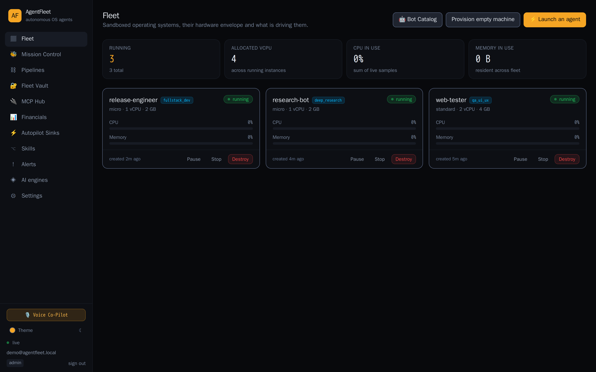
</p>

<p align="center"><em>The fleet: every machine, its hardware envelope, and what its agent is doing right now.</em></p>

<table>
  <tr>
    <td width="50%">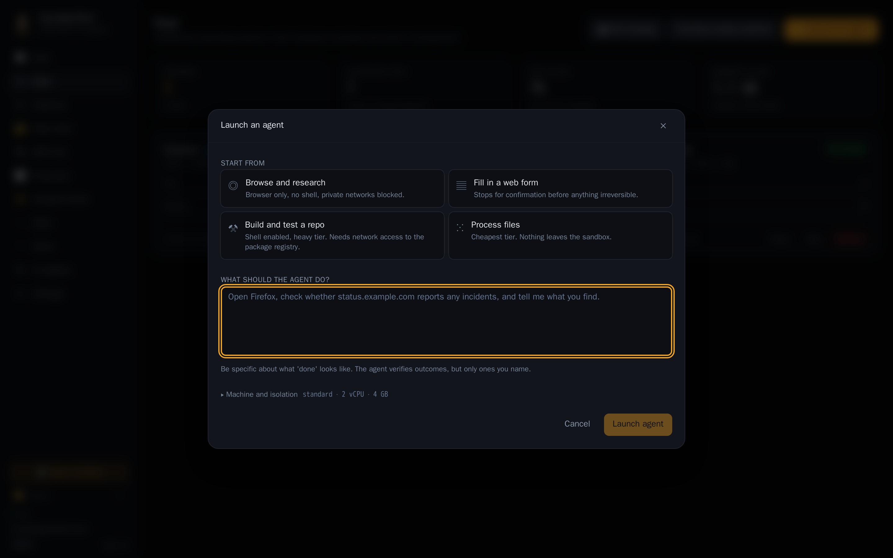</td>
    <td width="50%">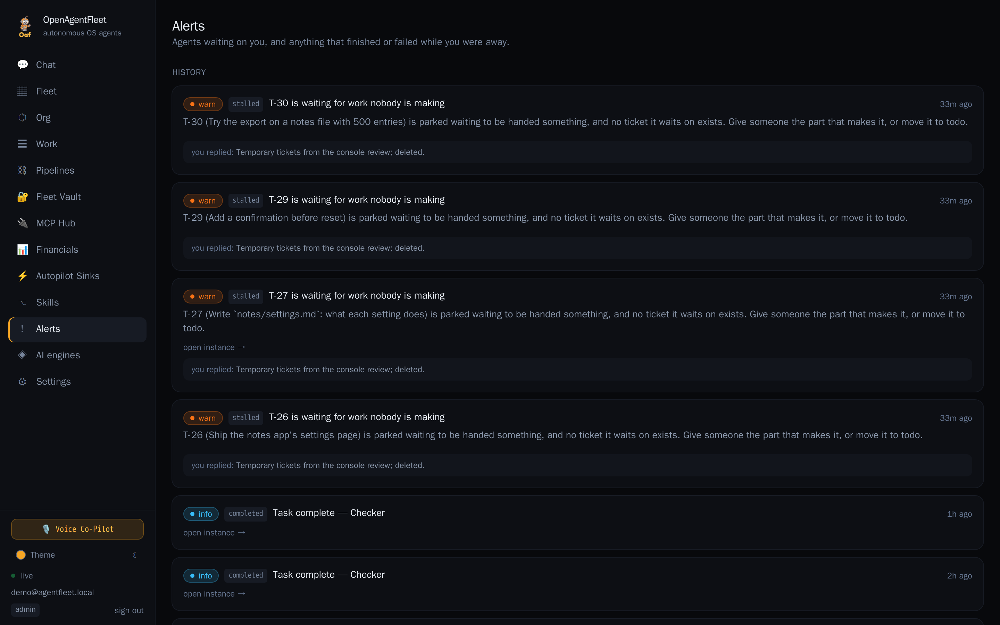</td>
  </tr>
  <tr>
    <td align="center"><strong>Launch an agent</strong><br><sub>Describe the task; it provisions the machine and starts the agent in one action.</sub></td>
    <td align="center"><strong>Resolution centre</strong><br><sub>Everything an agent is blocked on, with the screen at the moment it stopped.</sub></td>
  </tr>
  <tr>
    <td width="50%">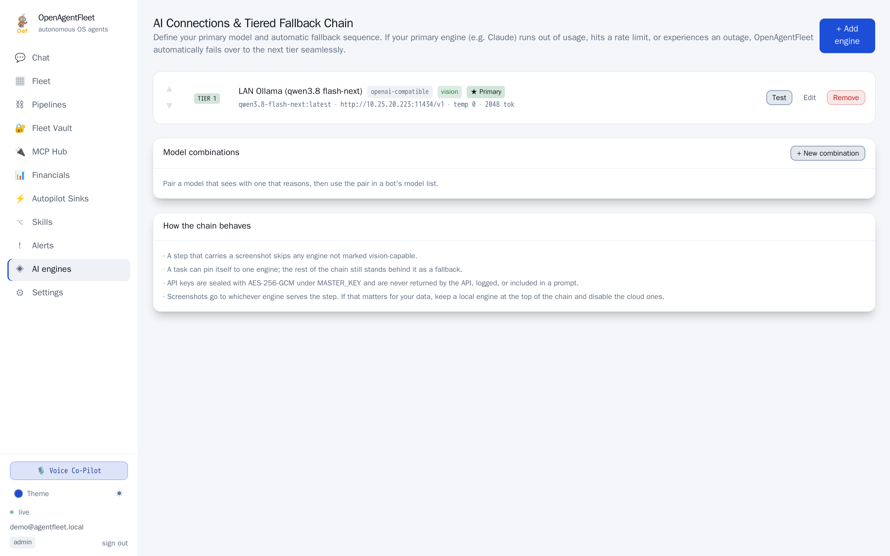</td>
    <td width="50%">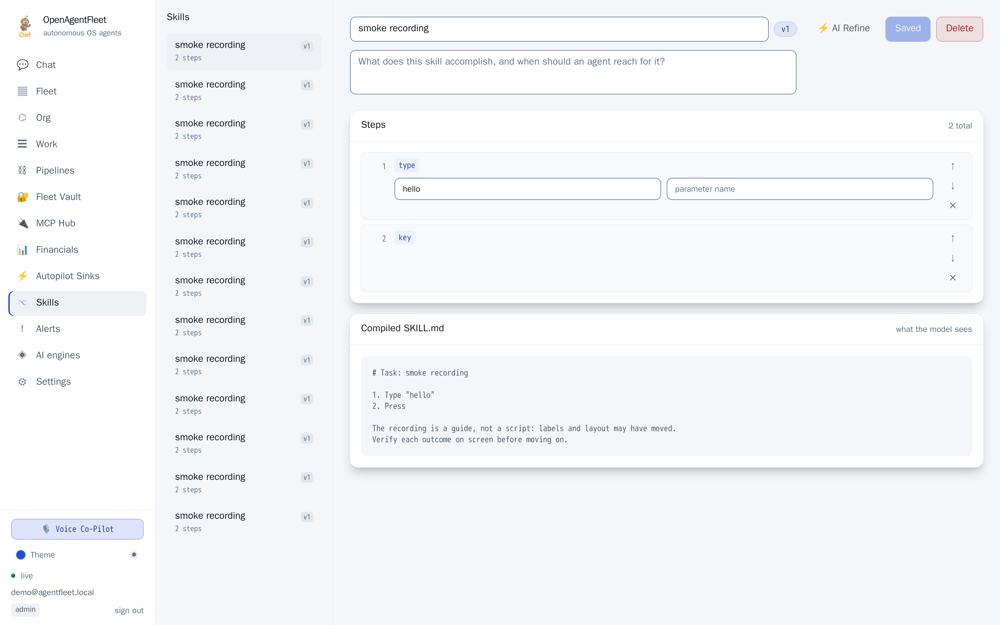</td>
  </tr>
  <tr>
    <td align="center"><strong>AI engines</strong><br><sub>An ordered fallback chain across local and cloud providers.</sub></td>
    <td align="center"><strong>Skill editor</strong><br><sub>Prune a recorded demonstration into the procedure you meant to show.</sub></td>
  </tr>
</table>

### Ten themes

Light and dark, each in five accents, switchable without a reload — and carried
identically into the Flutter companion app.

<table>
  <tr>
    <td>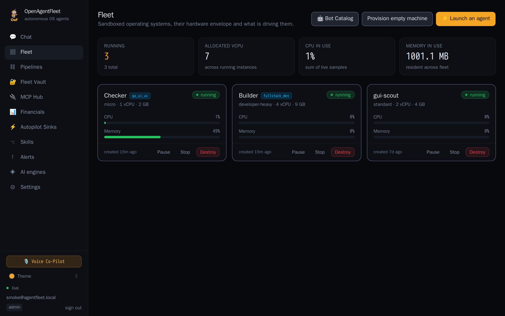</td>
    <td>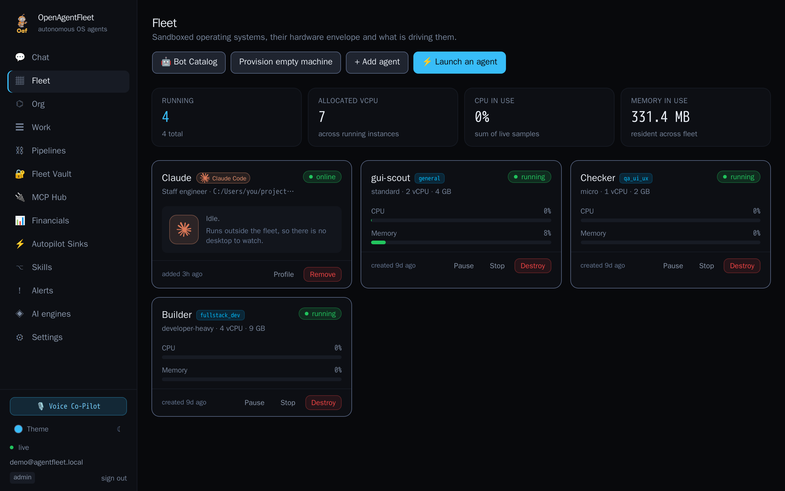</td>
    <td>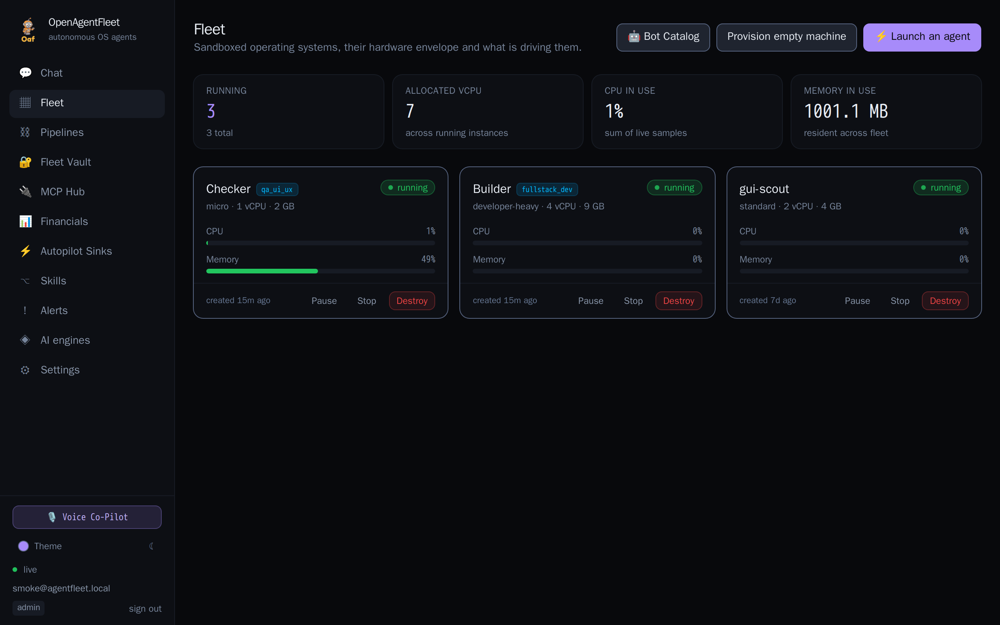</td>
  </tr>
  <tr>
    <td>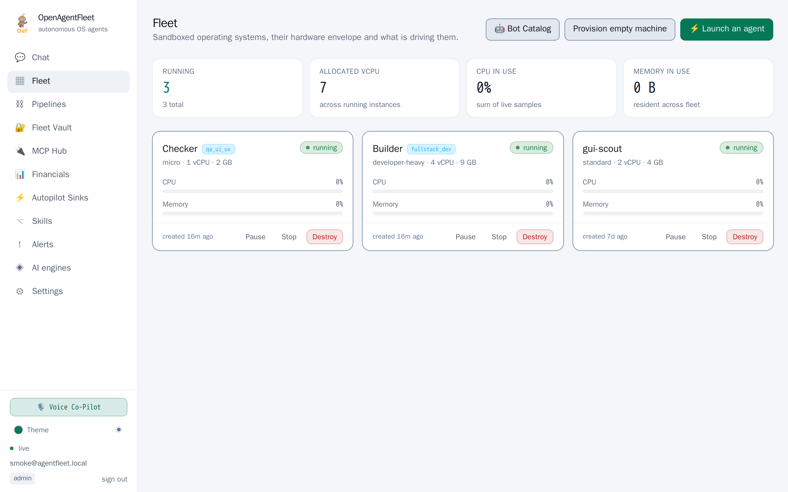</td>
    <td>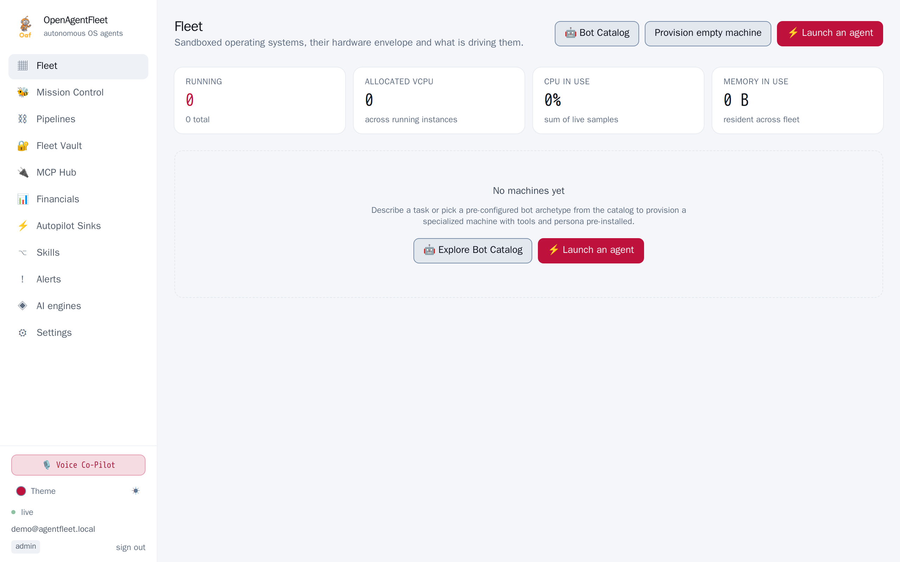</td>
    <td>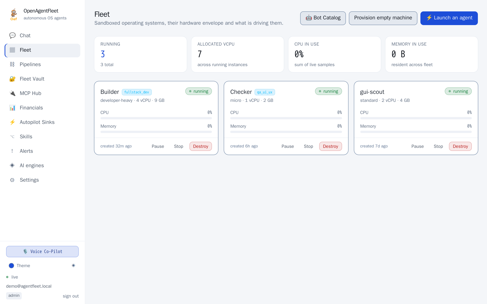</td>
  </tr>
</table>

More in the [interface gallery](docs/UI.md).

## Quick Start

### Prerequisites
* **Docker & Docker Compose** (v24+) — Linux, macOS or Windows (WSL 2). See the [platform guide](docs/PLATFORMS.md).
* **Ollama** with a vision model pulled (e.g. `ollama pull qwen2.5vl:7b`) OR a cloud API key (OpenAI, Anthropic, Gemini).

```bash
# 1. Clone repository and verify environment
git clone https://github.com/BryantVanOrden/AgentFleet.git
cd AgentFleet

# 2. Run preflight doctor (checks Docker, RAM, ports, secrets, vision models)
make doctor

# 3. Build sandbox images and start platform
make up
```

Once started:
1. Open the Admin Console at **<http://localhost:8081>**.
2. Complete the one-time administrator bootstrap.
3. Under **Engines**, test your local Ollama endpoint or add cloud API keys.
4. Click **⚡ Launch an Agent** to start your first autonomous workflow!

---

## Verifying with Smoke Tests

```bash
# Basic smoke test: provisions sandbox, verifies observation, injects input, checks screen dhash change
make smoke

# Full end-to-end agent smoke test with real autonomous model execution
make smoke-agent
```

---

## Project Architecture & Directory Layout

| Directory | Description |
| :--- | :--- |
| [`backend/`](backend/) | High-performance Go orchestrator (fleet supervisor, agent perceive-decide-act loop, model gateway, vault, SQLite/Postgres persistence, WebSocket event bus) |
| [`sandbox/`](sandbox/) | Ubuntu desktop container image (XFCE, Xvfb, AT-SPI accessibility bus, x11vnc, noVNC proxy, and the `agentd` daemon) |
| [`admin/`](admin/) | React 19 + TypeScript + Vite + Tailwind CSS operator console (fleet dashboard, live VNC streams, skill timeline editor, AI refinement studio) |
| [`mobile/`](mobile/) | Flutter companion app (real-time desktop streaming, interactive agent chat, resolution centre, FCM/APNs push notifications) |
| [`scripts/`](scripts/) | Preflight health check (`doctor.sh`) and end-to-end integration test (`smoke.sh`) |
| [`docs/`](docs/) | In-depth technical guides, architecture specifications, and security model |

---

## The Perceive → Decide → Act Loop

```
1. Observe   ──► agentd grabs WebP frame, active window title, AT-SPI tree, and perceptual dhash.
2. Guard     ──► If screen hash is unchanged across 3 actions, the agent pauses and escalates to your phone.
3. Prompt    ──► Assembles goal, SKILL.md guide, recent history, REPL variables, and downscaled screenshot.
4. Decide    ──► Model returns exactly one structured JSON action.
5. Act       ──► Translates coordinates to desktop pixel space and executes via agentd (or runs persistent Python / spawns child agent).
6. Persist   ──► Stores screenshot, duration, prompt/completion token metrics, and outcome in audit trail.
7. Refine    ──► Upon task success, the Continual Refinement Engine self-heals selectors and updates SKILL.md.
```

---

## Available Commands

```bash
make doctor           # Check Docker, RAM, ports, secrets, and model availability
make up               # Build sandbox image and start entire stack
make down             # Stop the stack (sandboxes are preserved)
make smoke            # Run end-to-end integration smoke test
make smoke-agent      # Run live autonomous task against an AI model
make clean-sandboxes  # Terminate and destroy all managed sandbox containers
make logs             # Tail orchestrator logs
make test             # Run Go test suites and React production build
```

---

## In-Depth Documentation

* 🛡️ [**Security Review**](docs/SECURITY-REVIEW.md) — An adversarial audit of the agent capabilities, with severities and fixes.
* ♿ [**Accessibility & Contrast**](docs/ACCESSIBILITY.md) — WCAG 2.1 AA contrast ratios measured across all ten themes.
* 💻 [**Platform Guide**](docs/PLATFORMS.md) — Running on Linux, macOS and Windows, and what is genuinely not portable.
* 🖼️ [**Interface Gallery**](docs/UI.md) — Every screen, all ten themes, and how the theming is built.
* 📐 [**Architecture Guide**](docs/ARCHITECTURE.md) — Detailed component design, data flow, schema, and networking model.
* 🔌 [**REST & WebSocket API Reference**](docs/API.md) — Complete endpoint specifications, request/response schemas, and real-time events.
* 🎓 [**Skills & Continual Refinement**](docs/SKILLS_AND_REFINEMENT.md) — Learn-by-demonstration recorder, AT-SPI compilation, and AI self-healing workflows.
* 🔒 [**Security & Threat Model**](docs/SECURITY.md) — Sandboxing guarantees, egress firewall rules, credential sealing, and prompt injection defenses.
* 🛠️ [**Developer Guide**](docs/DEVELOPER_GUIDE.md) — Local development workflow, running tests, and building mobile/admin frontends.
* 🗺️ [**Roadmap**](docs/ROADMAP.md) — Current capabilities and upcoming milestones.

---

## License

AgentFleet is distributed under the **[PolyForm Noncommercial License 1.0.0](LICENSE)**.

* **Non-Commercial Use**: Free for personal, research, academic, and non-commercial evaluation use.
* **Commercial & Enterprise Use**: For commercial deployments, SaaS integration, or commercial redistributions, a commercial license is required. Contact **Bryant VanOrden** (`supermanismebvo123@gmail.com`) for enterprise terms.
