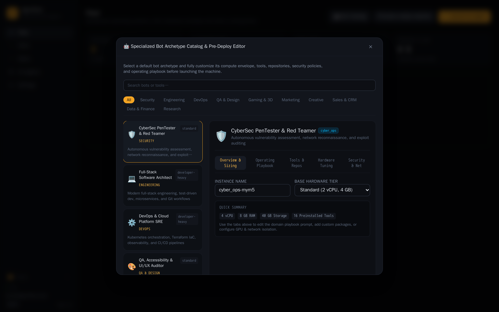
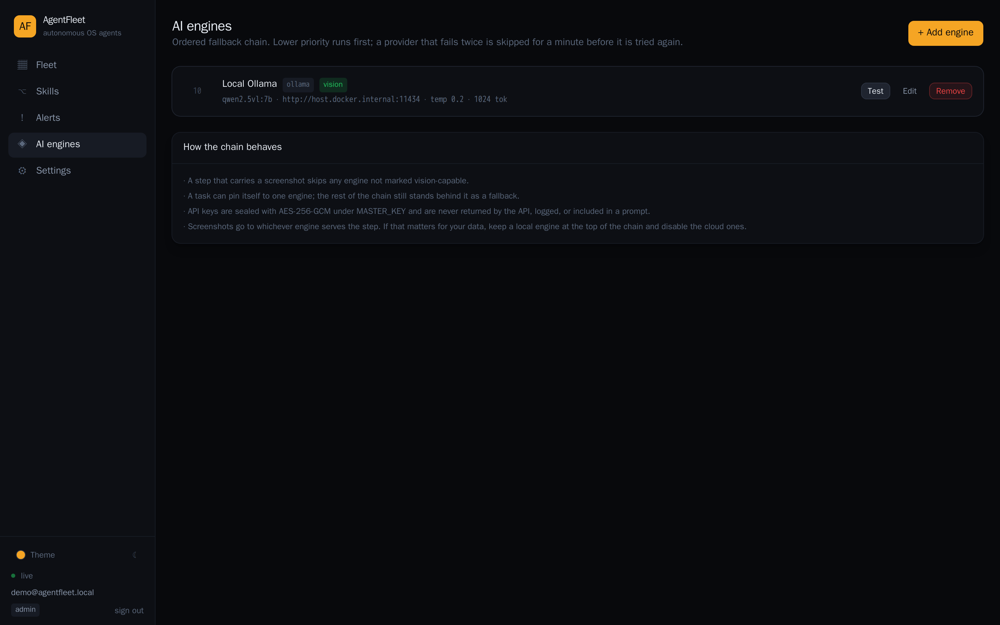
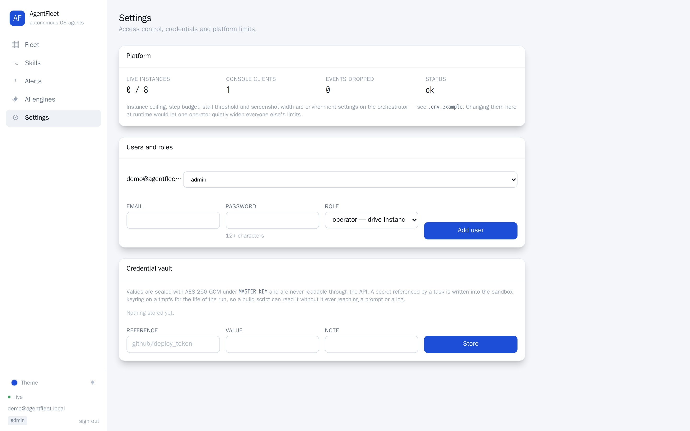
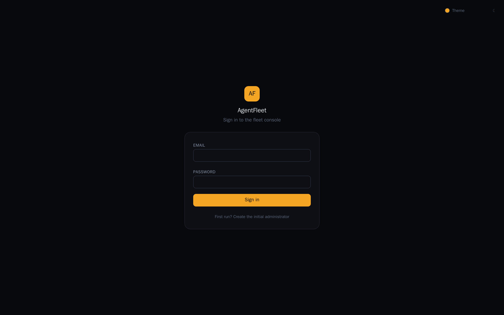
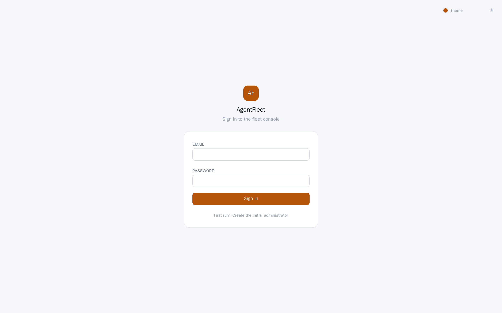
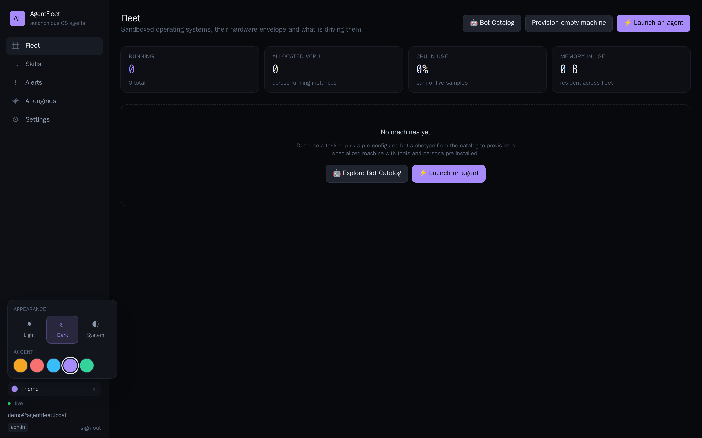
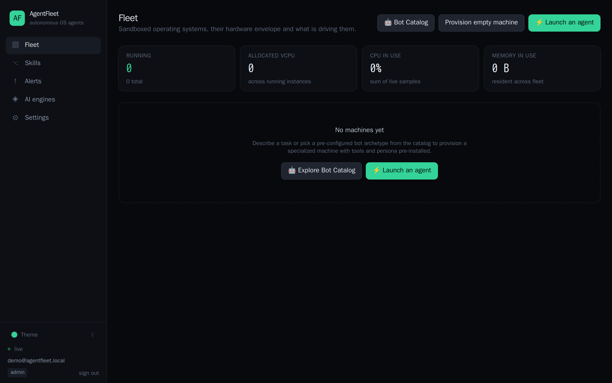
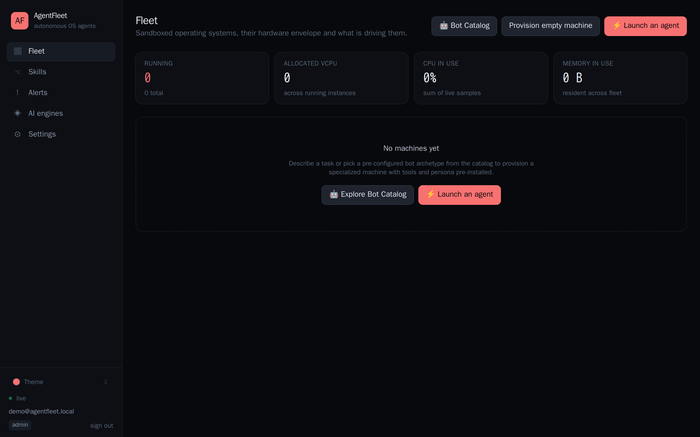
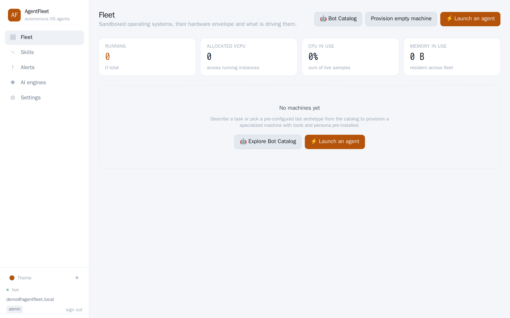
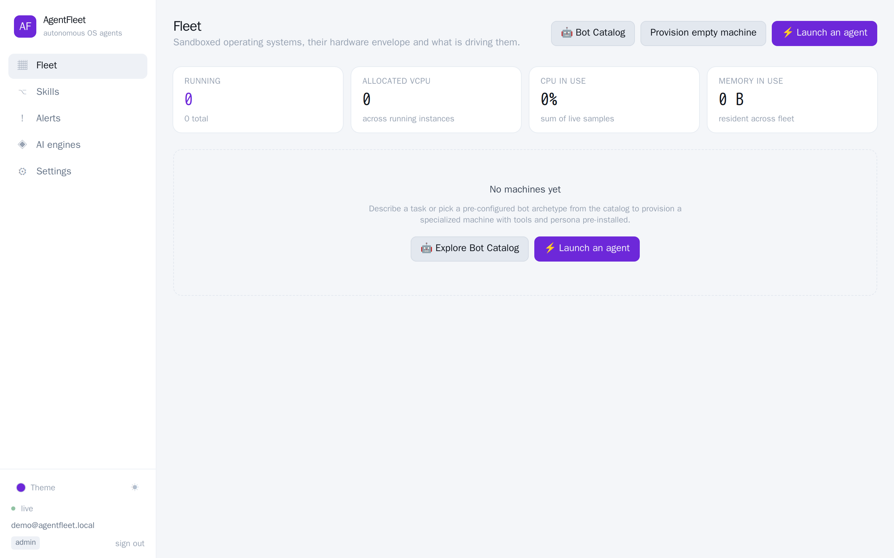

# Interface

Every image on this page is a real screenshot of the running console, captured
headlessly against a live orchestrator by [`scripts/screenshots.mjs`](../scripts/screenshots.mjs).
Nothing here is a mockup. To regenerate them after a UI change:

```bash
make screenshots
```

The fleet is empty in these captures because they run against a fresh
deployment — that is the genuine first-run state, not a staged one.

---

## The console

### Fleet

The control room. Every machine, its hardware envelope, live CPU and memory, and
what its agent is doing *right now* — the current action and the model's own
reasoning, streamed from the event socket rather than polled. A machine waiting
on a human turns amber and says so.


### Launch an agent

Describe the task; the console provisions a machine, waits for the desktop to
come up, and starts the agent — one action. Templates carry sensible isolation
defaults for the kind of work being done, and the machine and isolation settings
stay available for anyone who wants them.


### Bot catalog

Pre-configured archetypes with their own hardware profile, toolchain and
domain-expert prompt.



### AI engines

The fallback chain. Providers are tried in priority order, so this page is
really "what runs first, and what catches it when that fails". **Test** does a
real round-trip, so a bad key surfaces here rather than three steps into a run.



### Skills

The timeline editor. A raw recording is always noisier than the task it
represents; this is where an operator prunes it to the procedure they meant to
demonstrate and marks the values that should vary between runs. Steps captured
without an accessible label are flagged `coordinate-only`, because those are the
ones that will break when the UI moves.


### Alerts

The resolution centre. Everything an agent is blocked on, with the screen at the
moment it stopped. Whatever you write back is handed to the agent as
authoritative — the one input it trusts above what is on its own screen.


### Settings

Access control, the credential vault, and platform limits.



### Sign-in

The theme control is reachable *before* authenticating — nobody should have to
sign in on a glaring screen to find the light switch.

| Dark | Light |
| --- | --- |
|  |  |

---

## Themes

Two independent axes: **mode** (light / dark / follow the system) and **accent**
(five choices). Ten combinations, switchable from the sidebar without a reload.



Accent is not only decoration. Operators running more than one deployment use it
to tell staging from production at a glance, which is a better reason to ship
five of them than taste.

### Dark

| Amber | Blue | Purple |
| --- | --- | --- |
|  |  |  |

| Green | Red |
| --- | --- |
|  |  |

### Light

| Amber | Blue | Purple |
| --- | --- | --- |
|  |  |  |

| Green | Red |
| --- | --- |
|  |  |

---

## How the theming is built

Worth knowing before changing a colour.

The console never hard-codes a hex value in a component. Two attributes on
`<html>` — `data-mode` and `data-accent` — select a set of CSS custom
properties, and the Tailwind theme tokens point at *those*. That is what lets
ten themes exist without a single component changing: `bg-ink-900` keeps
working, it just resolves differently.

The `ink` scale is named for **depth, not darkness**. `ink-950` is always
"furthest back" and `ink-100` is always "most prominent text", so in light mode
`ink-950` is near-white. That is deliberate — the alternative was renaming every
utility across a dozen files, and the mapping is stated once here and once in
`admin/src/index.css`.

Two details that are easy to get wrong and are handled:

- **No flash of the wrong theme.** The theme is applied by an inline script in
  `index.html` before first paint. Reading it in React instead would render one
  frame of the default theme first, which is the thing dark-mode users notice.
- **Light-mode accents are deep, not pastel.** An accent is used as a button
  fill carrying white text, and a pastel cannot do that accessibly. The light
  palette uses the 700–800 range where the dark palette uses 300–400.

The Flutter companion app carries the same two axes and the same palette values,
so an operator moving between phone and console does not have to relearn what a
colour means. Its implementation is a real `ThemeExtension` (`FleetColors`) —
see `mobile/lib/core/theme/theme.dart`.
